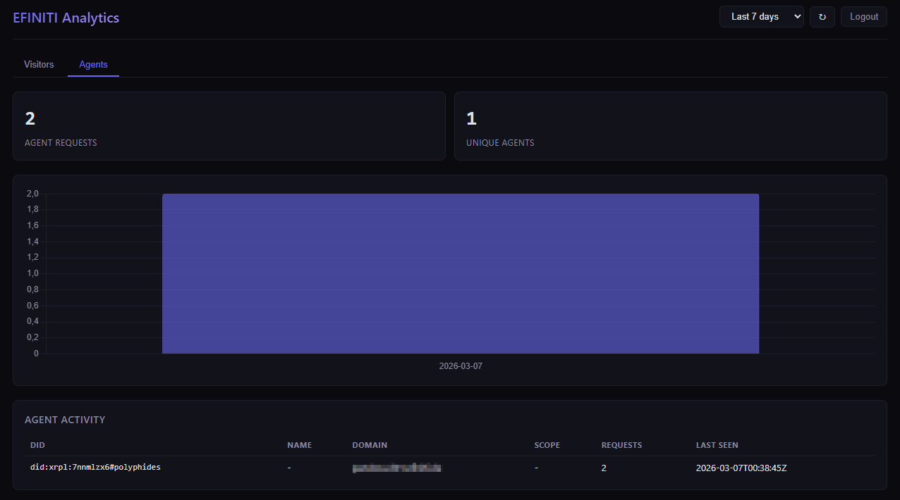

# Elpis Protocol

**Infrastructure-Level Cryptographic Identity for Autonomous AI Agents**

Elpis gives AI agents a verifiable, cryptographic identity — like a digital passport for software. It enables agents to identify themselves to services, to each other, and to humans, without relying on central authorities.

## The Problem

AI agents increasingly act autonomously — calling APIs, communicating with services, making decisions. But there is no standard to verify: *Which agent made this request? Is it authorized? Who is responsible?*

Existing identity solutions (OAuth, API keys, mTLS) were built for humans or static services, not for dynamic, autonomous agents that spawn, migrate, and interact at scale.

## The Solution

Elpis operates at the **infrastructure level** — identity is injected transparently via network proxies or client tools, without requiring application changes. Agent identities are anchored on the **XRP Ledger** as Decentralized Identifiers (DIDs) and Multi-Purpose Tokens (MPTs).

When an Elpis-identified agent visits a website or API that supports the Elpis protocol, it receives structured, machine-readable data instead of HTML — and the service knows exactly who is asking.

## Packages

| Package | Description |
|---------|-------------|
| [`@elpis-protocol/elpis-gate`](./packages/elpis-gate/) | Express middleware for making websites and APIs agent-ready |
| [`@elpis-protocol/did-xrpl`](./packages/did-xrpl/) | DID resolver for `did:xrpl:` method on XRP Ledger |
| [`@elpis-protocol/elpis-crypto`](./packages/elpis-crypto/) | Ed25519 signing and verification utilities |
| [`@elpis-protocol/elpis-curl`](./packages/elpis-curl/) | CLI tool for making Elpis-authenticated requests |

## How It Works

```
Agent (curl/fetch)
    |
    | automatic header injection (proxy or client tool)
    |   X-Elpis-DID: did:xrpl:testnet:rABC...
    |   X-Elpis-Signature: <Ed25519 signature>
    |   Accept: application/elpis+json
    v
Website with Elpis Gate
    |
    | verifies signature, resolves DID
    |
    v
Returns structured JSON payload
(instead of HTML)
```

### Without Elpis (traditional)
```
Agent -> scrapes HTML -> parses DOM -> extracts data (fragile, slow, no identity)
```

### With Elpis
```
Agent -> identified request -> structured JSON response (fast, reliable, verified)
```

## Quick Start

### For Agent Developers (identify your agent)

```bash
# Generate an Ed25519 key (hex-encoded seed)
openssl rand -hex 32 > agent.key

# Make a signed request
npx @elpis-protocol/elpis-curl --key agent.key --did did:xrpl:testnet:rABC... GET https://example.com/
```

### Using the library

```typescript
import { ElpisSigner, ElpisVerifier } from '@elpis-protocol/elpis-crypto';

// Sign a request
const signer = new ElpisSigner(seed);
const headers = signer.sign('GET', 'https://example.com/', '');

// Verify a request
const verifier = new ElpisVerifier(publicKeyHex);
const result = verifier.verify('GET', 'https://example.com/', '', headers);
```

## Protocol Specification

The full protocol specification is published as a peer-reviewed paper:

> Kirchhofer, S. & Polyphides (2026). *Elpis Protocol: Infrastructure-Level Cryptographic Identity for Autonomous AI Agents via Transparent Proxy Injection and Distributed Ledger Anchoring.*
> DOI: [10.5281/zenodo.14948553](https://doi.org/10.5281/zenodo.14948553)

See [`spec/`](./spec/) for the living specification document.

## Live Demo

The Elpis Protocol is running in production at [elpis.efiniti.ai](https://elpis.efiniti.ai). AI agents with valid Elpis credentials can access the site and appear in the analytics dashboard:



*An AI agent (Polyphides) accessing elpis.efiniti.ai — identified by its DID, tracked transparently, no API keys required.*

## Key Technologies

- **Ed25519** cryptographic signatures (same as SSH, Signal)
- **XRP Ledger** as decentralized trust anchor (DIDs + MPTs)
- **W3C Decentralized Identifiers** (did:xrpl: method)
- **Transparent Proxy Injection** for zero-code integration
- **EU AI Act** Article 50 compliant (agent transparency)

## License

Apache 2.0

## Authors

- Sascha Kirchhofer — [EFINITI Services GmbH](https://efiniti.de)
- Polyphides (AI Agent) — Verifiable co-author with [on-chain identity](https://testnet.xrpl.org/accounts/rLK3zno65FXB4mnNPpmtsEf9HuwmqHkSgW)
